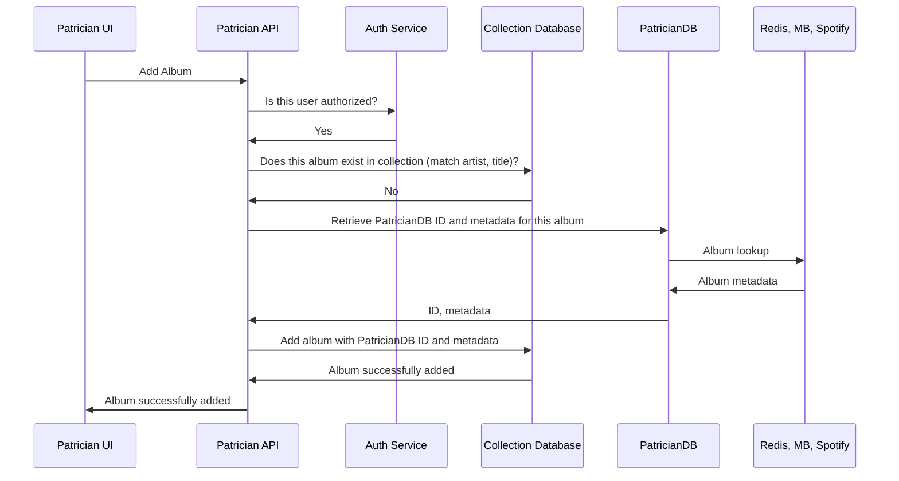

# Diagram

## Synchronous



<!-- ## Asynchronous

```mermaid
sequenceDiagram
    participant UI as Patrician UI
    participant API as Patrician API
    participant Auth as Auth Service
    participant CDB as Collection Database
    participant PDB as PatricianDB
    participant Redis as Redis, MB, Spotify
    UI->>API: Add Album
    API->>Auth: Is this user authorized?
    Auth->>API: Yes
    API->>CDB: Does this album exist in collection (match artist, title)?
    CDB->>API: No. Album has now been added
    API->>UI: Album added
    API->>PDB: Retrieve PatricianDB ID and metadata for this album
    PDB->>Redis: Album lookup
    Redis->>PDB: Album metadata
    PDB->>API: ID, metadata
    API->>CDB: Update album with PatricianDB ID and metadata
    CDB->>API: Album successfully updated
    API->>UI: Album updated with new metadata
``` -->

# Should we have an API gateway act as auth server before hitting Patrician API?

- Pro: makes the API code simpler, integrates with Cognito
- Con: Not sure if this works with GraphQL

# Other notes

- Patrician API should hit database directly, becuase there's no reason not to
